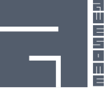
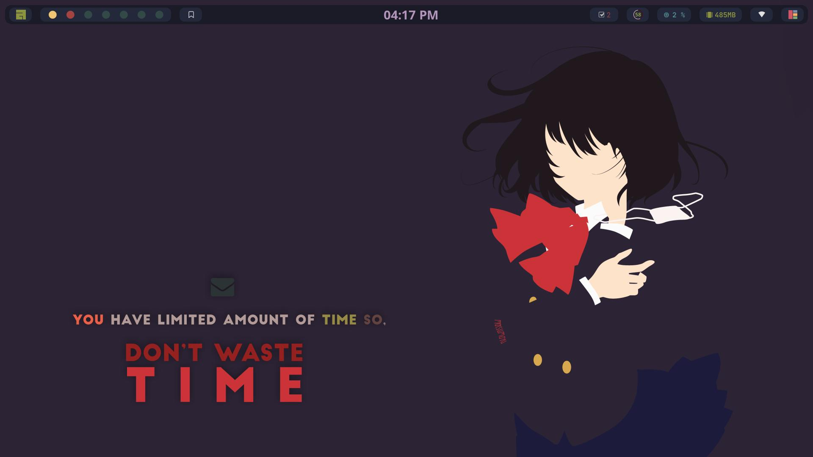
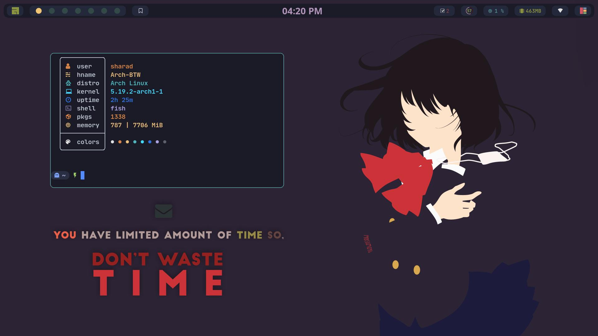
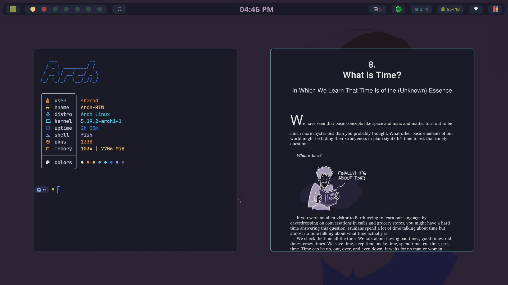

<!-- My dotfiles for gnu/linux -->

  

  
  
  
  

<h1 style="color:blue;">The AwesomeWM</h1>

  
  
  

<table align="right">
  <tr>
    <td align="center">
      
            <samp style="color:green;">
                  If you like this setup, please drop  a star. 
                  I really appreciate it. Thanks!
            </samp>
      
    </td>
  </tr>

<table>

## Thanks for visiting!

⚠️ **NOTE!!!!!** This was made for a **1920x1080** screen and on a **Laptop** with **96** dpi.
