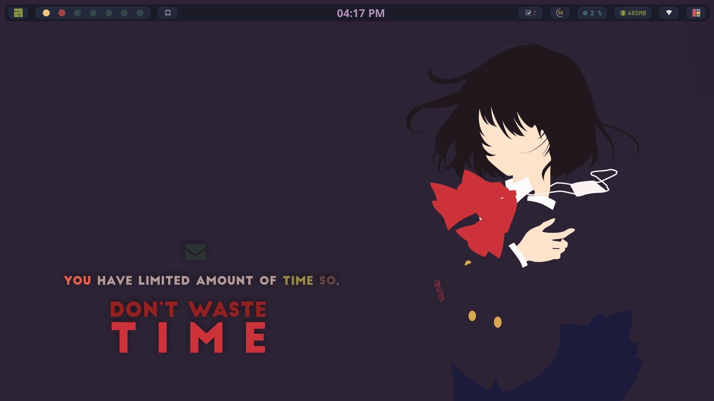
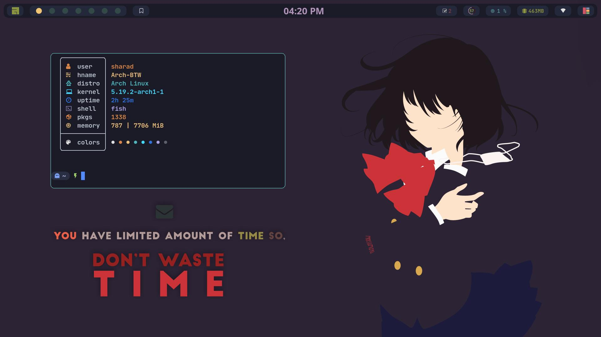
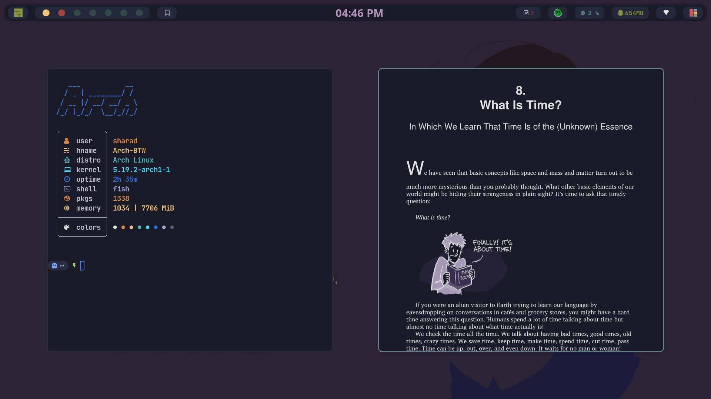

<!-- My dotfiles for gnu/linux -->

<div align="center">
  
</div>

<div align="center">
  
  
  
  
</div>

<hr></hr>

<div align="center">
<h1 style="color:blue;">The AwesomeWM</h1>
</div>
<div align="center">
  
  
  
</div>


<table align="right">
  <tr>
    <td align="center">
      <sup>
            <samp style="color:green;">
                  If you like this setup, please drop  a star.<br>
                  I really appreciate it. Thanks!
            </samp>
      </sup>
    </td>
  </tr>

<table>

## Thanks for visiting!

The [setup section](#setup) will guide you through the installation process.

</table>
<br>


<!-- INFORMATION -->
## :snowflake: ‎ <samp>Information</samp>

Here are some details about my setup:

- **OS:** [Arch Linux](https://archlinux.org)
- **WM:** [awesome](https://github.com/awesomeWM/awesome)
- **Terminal:** [kitty](https://github.com/kovidgoyal/kitty)
- **Shell:** [fish](https://www.zsh.org/)
- **Application launcher:** [dotfiles](https://github.com/DaveDavenport/rofi)
- **widgets:**[eww](https://github.com/elkowar/eww)
- **Compositor:** [picom-pijulius-git](https://github.com/pijulius/picom)
- **Editor:** [neovim](https://neovim.io)
- **Music Player** [ncmpcpp](https://github.com/ncmpcpp/ncmpcpp)


<!-- SETUP -->
## :wrench: ‎ <samp>Setup</samp>

<details>
<summary><b>1. Install AwesomeWM</b></summary>

Install the **[git version of AwesomeWM](https://github.com/awesomeWM/awesome/) built with LUA 5.3**

**Arch users** can use this following command

```
yay -S awesome-git
or,
paru -S awesome-git
```

**For other distros**, build instructions are [here](https://github.com/awesomeWM/awesome/#building-and-installation).
</details>

<details>
<summary><b>2. Install Dependencies</b></summary>

| Dependency                              | Why/Where is it needed?                                   |
|-----------------------------------------|-----------------------------------------------------------|
| networkmanager                          | Network notifcations, applet/wibar widget                 |
| blueman                                 | Bluetooth notifcations, applet/wibar widget               |
| pipewire+pipewire-pulse/pulsaudio       | Used by pactl                                             |
| inotify-tools                           | Daemons that monitor filesystem events                    |
| redshift                                | Blue light toggle                                         |
| maim                                    | Screenshot widget                                         |
| flameshot                               | Screenshot widget                                         |
| ffmpeg                                  | Record widget                                             |
| xdotool                                 | Menu commands use this to input text into terminal        |
| xclip                                   | Copy screenshot into clipboard/paste text into prompt     |
| farge                                   | Color picker keybind                                      |
| upower                                  | Battery notifications/widgets                             |
| picom                                   | Compositor widget/notifcations                            |
| brightnessctl                           | Brightness daemon and widget                              |
| playerctl                               | Media daemon and controls                                 |
| imagemagick                             | Used to generate colors from wallpapers                   |
| yad                                     | Used to pick a folder                                     |

**Arch Linux (and other Arch-based distributions)**
   ```sh
      pacman -Sy kitty networkmanager blueman pipewire pipewire-pulse lm_sensors inotify-tools
      redshift maim  xdotool xclip upower brightnessctl playerctl mod flameshot
      xfce4-settings imagemagick yad --needed
   ```
   Assuming your **AUR Helper** is [paru](https://github.com/Morganamilo/paru).
   ```sh
      paru -S picom-pijulius-git --needed
   ```
</details>

<details>
<summary><b>4. Install awesomeWM</b></summary>

> Clone this repository

   ```sh
   git clone --depth=1 https://gitlab.com/sharad777/dotfiles ~/.config/awesome
   ```

   Congratulations, you have installed this aesthetic dotfiles!
</details>


<!-- Keybinds -->
## ⌨️ ‎ <samp>Keybinds</samp>

<details>
<summary><b>Awesome</b></summary>

| Keybind | Action |
| ------- | ------ |
| <kbd>super + r </kbd> | Reload awesome |
| <kbd>super + shift + q</kbd> | Quit awesome |
</details>


<br>

## <samp><b>Credits</b></samp>

* special thanks to :heart:
    * [moonlight-coffee](https://github.com/Moonlight-Coffee)
    * [justleoo](https://github.com/justleoo)

<br>

* also these 🌃 awesome people!
    * [Javacafe01](https://github.com/javacafe01)
    * [manilarome](https://github.com/manilarome)
    * [elenapan](https://github.com/elenapan)
<br>
<br>
<br>

<hr></hr>
⚠️ **NOTE!!!!!** This was made for a **1920x1080** screen and on a **Laptop** with **96** dpi.
